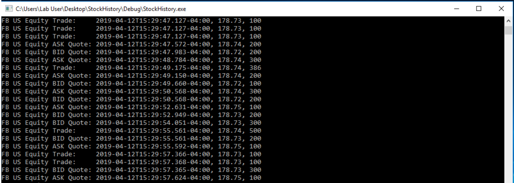

# FRE7831-Financial-Analytics-and-Big-Data

### homework 1: Historical data extraction from Bloomberg API
1. Add the following fields for market data retrieval:
  + Daily Volume
  + High Price
  + Low Price
2. Change the startDate to 1st day of the year and endDate to today.
3. Write the historical data you collect into a file instead of on screen
---------------------------------

### homework 2: Real-time data extraction from Bloomberg API
1. Retrieve Ask side of real-time quotes: ask price and ask size of each quote.
2. Write the real-time data you collect into a file in addition to what shown on screen.

----------------------------------
### homework 3: Trading data handling 
Develop a C++ (or Python) program to use SPY_May_2012.csv for the following tasks:
1. Use only the trade quantities and their corresponding prices. We will not consider any quote.
2. For intraday day, we combine trading quantities into each 15min interval according to the timestamp of each trade.
3. For the quantity of each 15 min interval, we sum up corresponding quantity for each trading day from 5/1/12 to 5/20/12, and then calculate the average for each time interval by dividing the sum by the number of trading days.
4. For the execution prices, we use the trading prices on 5/21/12. We assume the price of 1st trade in each time interval as the execution price for the entire interval.
5. We only consider the trades occurred between 9:30am to 4:00pm.
6. Save your results in outputs.csv file.

----------------------------------
### homework 4: MarketDataDB database creation
Complete MarketDataDB database according to the details on slides for our class topic BLPAPI-RDB and populate your DailyData table for stocks: GOOG, IBM, MSFT and TWTR from 1/1/2018 to 12/31/2018. 

----------------------------------
### homework 5: MapReduce Implementation 
Modify our MapReduce.cpp for processing the attached news file, 4727.txt, to create the `word count` as shown in output.txt
