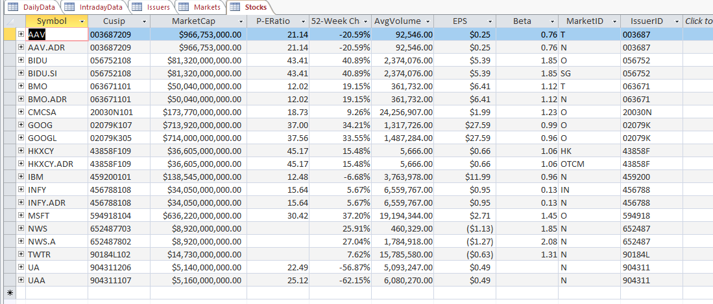

# FRE7831-Financial-Analytics-and-Big-Data

**Keep updating..**

### homework 1: Historical data extraction from Bloomberg API
1. Add the following fields for market data retrieval:
  + `Daily Volume`
  + `High Price`
  + `Low Price`
2. Change the startDate to 1st day of the year and endDate to today.
3. Write the historical data you collect into a file instead of on screen
---------------------------------

### homework 2: Real-time data extraction from Bloomberg API
1. Retrieve Ask side of real-time quotes: ask price and ask size of each quote.
2. Write the *real-time* data you collect into a file in addition to what shown on screen.


----------------------------------
### homework 3: Trading data handling 
Develop a C++ (or Python) program to handle large dataset `SPY_May_2012.csv` (~2G) for the following tasks:
1. Use only the trade quantities and their corresponding prices. We will not consider any quote.
2. For intraday day, we combine trading quantities into each 15min interval according to the timestamp of each trade.
3. For the quantity of each 15 min interval, we sum up corresponding quantity for each trading day from 5/1/12 to 5/20/12, and then calculate the average for each time interval by dividing the sum by the number of trading days.
4. For the execution prices, we use the trading prices on 5/21/12. We assume the price of 1st trade in each time interval as the execution price for the entire interval.
5. We only consider the trades occurred between 9:30am to 4:00pm.
6. Save your results in `outputs.csv` file.

Python version solution using **pandas** is also added, which is much faster than C++ version solution. Neater way to handle CSV file in C++ should be used. The outputs is shown as follows:


----------------------------------
### homework 4: MarketDataDB database creation
Complete **MarketDataDB** database according to the details on slides for our class topic *BLPAPI-RDB* and populate your **DailyData** table for stocks: `GOOG`, `IBM`, `MSFT` and `TWTR` from 1/1/2018 to 12/31/2018. 

#### Databaase schema

Create a relationaol database in `Microsoft Access` for market data and retrieve daily and intraday data from `BLP API` to poplulate the data tables as follows:
1. **Markets** - contains market inform


2. **Issuers** - contains issuer inform
+ *MarketID (PK), MarketName, TimeZone, Country, CurrencyCode*


3. **Stocks** - contains stock inform
+ *Symbol (PK), Cusip, marketCap, P-Eratio, 52-Week Change, AvgVolumne*


4. **Daily Data** - contains stock daily data inform 
+ *(TradeDate, Symbol) (PK), Open, Close, High, Low*


5. **Intraday Data** - conatains stock intraday data inform 
+ *TradeTime (PK), BidPrice, BitQty, AskPrice, AskQty, TradePrice*

The `Entity-Relationship Diagram` is shown as follows 


----------------------------------
### homework 5: WordCount Implementation using MapReduce 
Modify `MapReduce.cpp` for processing the attached news file, `4727.txt` with file partial display:


to create the **word count** as shown in `output.txt` with file partial display:


----------------------------------
### homework 6: 
1. Create Virtual Machine for **Hornworks Sandbox** in **Microsoft Azure**. 
2. Load raw data `stocks.zip` file into *Hadoop File System*. 
3. Create tables `price_data`, `dividends_data` and `yearly_aggregates` in the default database.

```SQL
create external table price_data 
(stock_exchange string, symbol string, trade_date string, open float, 
high float, low float, close float, volume int, adj_close float) 
row format delimited fields terminated by ',' 
stored as textfile location '/user/hue/stocks/stocks/prices';

create external table dividends_data 
(stock_exchange string, symbol string, trade_date string, dividend float) 
row format delimited fields terminated by ',' 
stored as textfile location '/user/hue/stocks/stocks/dividends';

create table yearly_aggregates 
(symbol string, year string, high float, low float, 
average_close float, total_dividends float)
row format delimited fields terminated by ',' 
stored as textfile location '/user/hue/stocks/stocks/stock_aggregates';
```
4. Populate Table `yearly_aggregates` and verify 
```SQL
insert overwrite table yearly_aggregates 
select a.symbol, year(a.trade_date), max(a.high), min(a.low), avg(a.close), sum(b.dividend) 
from price_data a 
left outer join dividends_data b 
on (a.symbol = b.symbol and a.trade_date = b.trade_date) 
group by a.symbol, year(a.trade_date);

select * from yearly_aggregates where symbol = 'IBM';
```


5. Connect **HDP VM** with a Python program via **ODBC**

6. Connect my Python program to **Hortonworks database** in **Azure** to pull `IBM yearly dividend` from `yearly_aggregates` table
```PYTHON
import pyodbc

pyodbc.autocommit = True
conn = pyodbc.connect("DSN=Sample Hortonworks Hive DSN;", autocommit=True)
cursor = conn.cursor();
cursor.execute("select year, symbol, total_dividends from default.yearly_aggregates where symbol = 'IBM' and year = '2005'")
result = cursor.fetchall() 
for r in result:
    print(r)
```
Result is:
```
('2005', 'IBM', 0.7800000309944153)
```

